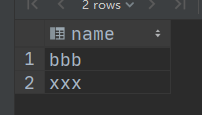

# 数据库 lab1 —— SQL

## 基本表代码

### book

```sql
create table book
(
    id     char(8) primary key,
    name   varchar(10) not null,
    author varchar(10),
    price  float check ( price >= 0 ),
    status int default 0 check ( status = 0 or status = 1 )
);
```

`id` 作为主键，`name` 根据要求添加 `not null` 约束，`price` 要求 >= 0 （`null` 也可以）,`status` 要求必须是 0 或 1.

### reader

```sql
create table reader
(
    id      char(10) primary key,
    name    varchar(10),
    age     int check ( age >= 0 ),
    address varchar(20)
);
```

`id` 作为主键，`age` 要求 >= 0 （`null` 也可以）。

### borrow

```sql
create table borrow
(
    book_id     char(8),
    reader_id   char(10),
    borrow_date date,
    return_date date check ( return_date >= borrow_date ),
    primary key (book_id, reader_id, borrow_date),
    foreign key (book_id) references book (id),
    foreign key (reader_id) references reader (id)
);
```

`(book_id, reader_id, borrow_date)` 三者作为主键，自定义完整性 `return_date>=borrow_date`, 同时 `book_id` 和 `reader_id` 分别作为参照 `book` 和 `reader` 的外键。

## 完整性的测试代码

通过特定表项插入时出现错误来检验完整性约束。

### 实体完整性

#### 主键不能为空

```sql
insert into book (id, name, author, price)
    value (null, 'Some Book', ' Someone', 2.33);
```
```
Column 'id' cannot be null
```

```sql
insert into borrow (book_id, reader_id, borrow_date, return_date)
    value ('00000000', 'PB00000000', null, null);
```
```
Column 'borrow_date' cannot be null
```

#### 不能插入重复主键，不能把已有项改为重复主键

```sql
insert into book (id, name, author, price)
    value ('00000000', 'Some book', null, null);
```
```
Duplicate entry '00000000' for key 'PRIMARY'
```

```sql
update book
set id='00000000'
where id = '00000001';
```
```
Duplicate entry '00000000' for key 'PRIMARY'
```

### 参照完整性

#### 不能插入参照表中不存在的外键

```sql
insert into borrow (book_id, reader_id, borrow_date, return_date)
    value ('notexist', 'PB00000000', date(19260817), null);
```
```
Cannot add or update a child row: a foreign key constraint fails (`library`.`borrow`, CONSTRAINT `borrow_ibfk_1` FOREIGN KEY (`book_id`) REFERENCES `book` (`id`))
```

```sql
insert into borrow (book_id, reader_id, borrow_date, return_date)
    value ('00000000', 'not exist_', date(19260817), null);
```
```
Cannot add or update a child row: a foreign key constraint fails (`library`.`borrow`, CONSTRAINT `borrow_ibfk_2` FOREIGN KEY (`reader_id`) REFERENCES `reader` (`id`))
```
#### 不能在参照表中删除正在被引用的项，除非设置为 `cascade delete`

```sql
delete
from book
where id = '00000000';
```
```
Cannot delete or update a parent row: a foreign key constraint fails (`library`.`borrow`, CONSTRAINT `borrow_ibfk_1` FOREIGN KEY (`book_id`) REFERENCES `book` (`id`))
```

```sql
delete
from reader
where id = 'PB00000000';
```
```
Cannot delete or update a parent row: a foreign key constraint fails (`library`.`borrow`, CONSTRAINT `borrow_ibfk_2` FOREIGN KEY (`reader_id`) REFERENCES `reader` (`id`))
```

### 自定义完整性

#### `not null` 约束

```sql
insert into book (id, name, author, price)
    value ('test0000', null, 'Someone', 2.33);
```

```
Column 'name' cannot be null
```

#### 数值关系约束
```sql
insert into book (id, name, author, price)
    value ('test0001', 'Some Book', 'Some One', -1);
```
```
CONSTRAINT `book.price` failed for `library`.`book`
```

```sql
insert into book (id, name, author, price, status)
    value ('test0002', 'Some Book', 'Some One', 2.33, 2);
```
```
CONSTRAINT `book.status` failed for `library`.`book`
```

```sql
insert into reader (id, name, age, address)
    value ('PBtest0000', 'Someone', -1, 'USTC');
```
```
CONSTRAINT `reader.age` failed for `library`.`reader`
```

```sql
insert into borrow (book_id, reader_id, borrow_date, return_date)
    value ('00000000', 'PB00000000', date(99991231), date(88881231));
```
```
CONSTRAINT `borrow.return_date` failed for `library`.`borrow`
```

## 小题和测试结果

三个表中数据为：


### (1)

```sql
select id, address
from reader
where name = '虞佳焕';
```


### (2)

使用多个表并用 `and` 添加条件的方法。
 
```sql
select book.name, borrow.borrow_date
from reader,
     book,
     borrow
where reader.id = borrow.reader_id
  and book.id = borrow.book_id
  and reader.name = '虞佳焕';
```


### (3)

先找出当前所有被借出的书，再用 `not in`.

```sql
select name
from reader
where id not in (
    select reader_id
    from borrow
    where return_date is null
);
```



### (4)

```sql
select name, price
from book
where author = 'Ullman';
```


### (5)

 同样的从多个表中 `select` 并使用 `and` 条件。

```sql
select book.id, book.name
from reader,
     book,
     borrow
where reader.name = '李林'
  and borrow.reader_id = reader.id
  and borrow.book_id = book.id
  and borrow.return_date is null;
```


### (6)

使用 `group` 和 `having`.

```sql
select reader.name
from reader,
     borrow
where borrow.reader_id = reader.id
group by borrow.reader_id
having count(borrow.borrow_date) > 3;
```

**这里我在 borrow 中临时添加了一些数据，否则原来的表中没有没有一人借阅次数大于 3, 之前之后几题还是基于一开始给出的表。**

borrow 表：


输出：


### (7)

先找出“李林”借的所有书，再在 borrow 中排除掉这些借阅记录，最后和 reader 表一起并使用 distinct 输出。

```sql
select distinct reader.name, reader.id
from reader,
     borrow
where reader.id = borrow.reader_id
  and borrow.book_id not in (
    select distinct book_id
    from borrow
    where reader_id = reader.id
      and name = '李林'
);
```


### (8)

```sql
select name, id
from book
where name like '%MySQL%';
```


### (9)

```sql
create view borrow_info (reader_id, reader_name, book_id, book_name, borrow_date) as
select borrow.reader_id, reader.name, borrow.book_id, book.name, borrow.borrow_date
from reader,
     book,
     borrow
where reader.id = borrow.reader_id
  and book.id = borrow.book_id;

select reader_id, count(book_id)
from borrow_info
where borrow_date > date_sub(current_date(), interval 1 year)
group by reader_id
having count(book_id) > 0;
```

view 为：


一年内借书的人有：


