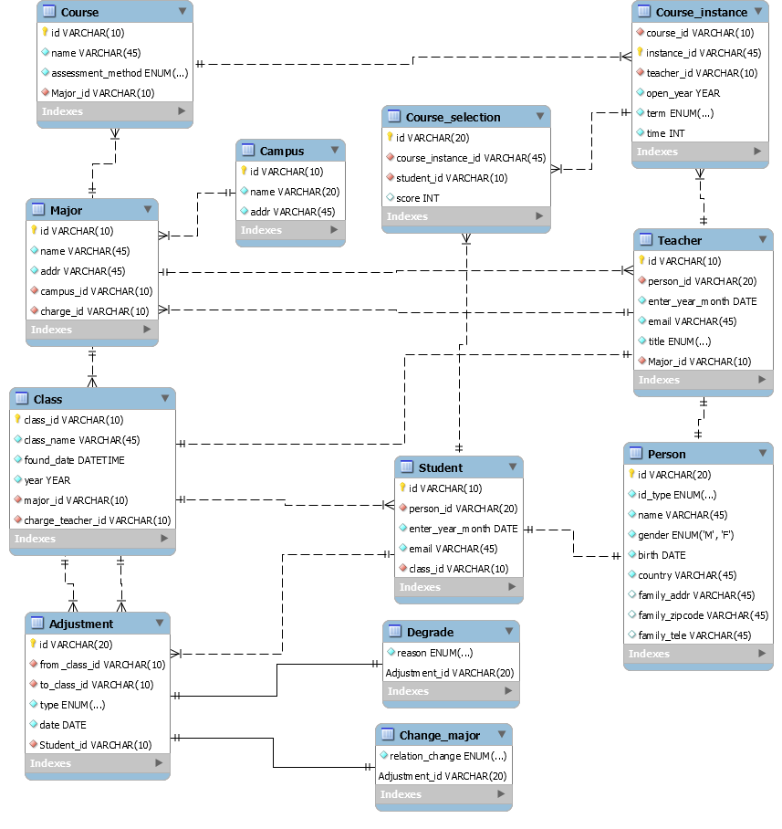
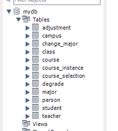

# 数据库 lab2

## 具体设计

### campus

记录校区 `id`(主键)和其他信息。

### major

记录专业的 `id`(主键)和其他信息，外键引用 `campus_id`(所在校区), `charge_id`(班主任)。

### course

记录课程的 `id`(主键)和其他信息，外键引用 `major_id`(所属专业)。

### course_instance

记录一种课程的具体开课。

记录 `instance_id`(主键)，外键引用对应的课程 `course_id` 和开课老师 `teacher_id` 和其他必要信息。

### person

记录教师和学生身份信息，`id` 为主键，有关家庭的信息不设置为 `not null`.

### student

记录学生信息。

`id` 为主键，外键引用 `class_id` 和 `person_id`.

### teacher

记录教师信息。

`id` 为主键，外键引用 `major_id` 和 `person_id`.

### class

记录班级。

`class_id` 为主键，外键引用 `major_id` 和 `charge_id` (班主任)。

### course_selection

记录选课。

`id` 为主键，外键引用 `course_instance_id` 和 `studend_id`, `score` 不设置为 `not null`.

### adjustment

记录学籍异动。

`id` 为主键，外键引用 `from_class_id` 和 `to_class_id` (都是引用 class)，还有 `student_id`.

### degrade

记录学籍异动中的降级，外键引用 `adjustment_id`(主键)。

### change_major

记录学籍异动中的转专业，外键引用 `adjustment_id`(主键)。

## ER 图

模式设计的 ER 图如下：

## 前向工程导出

导出的表如下：

